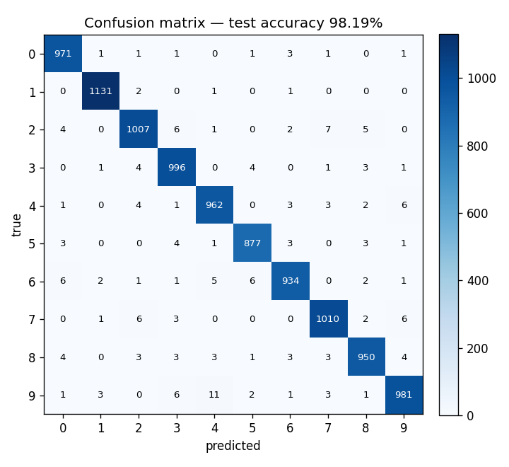
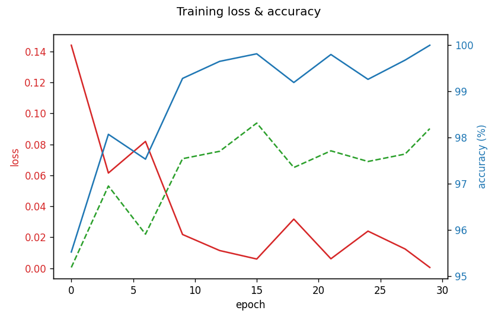

# 🧠 Handwritten-Digit Neural Network — Built From Scratch

> A 3-layer neural network implemented from scratch in **pure NumPy** (no PyTorch, TensorFlow, or scikit-learn) that classifies MNIST digits at **98.19% test accuracy**, wrapped in a live "draw-a-digit" web app.

**🎨 Live demo:** _<add your Hugging Face Spaces URL here>_ · Or run it locally in 3 commands (below).

---

## Result

| Model | Loss | Batch | Epochs | Test accuracy |
|---|---|---|---|---|
| Original tiny net (`784-10-10`)¹ | cross-entropy | full | 980 | 92.08% |
| Expanded (`784-128-64-10`), full-batch | cross-entropy | full | 200 | 91.67% |
| Expanded, full-batch | **MSE** | full | 200 | 89.21% |
| **Expanded, mini-batch (shipped model)** | **cross-entropy** | 64 | 30 | **98.19%** |
| Expanded, mini-batch | MSE | 64 | 30 | 98.18% |

¹ The original notebook reported **85.47% _train_** accuracy (test was never measured). Reproducing that exact architecture — but with two bug-fixes (per-neuron bias gradient, He initialization) — already lifts it to **92% test**.

<p align="center">
  
  
</p>

### What moved the numbers (Step 3 deltas)
- **Cross-entropy vs. MSE:** at a fair comparison (full-batch, 200 epochs) cross-entropy beats MSE by **+2.46 pts** (91.67% vs 89.21%). With enough mini-batch steps both saturate near 98%, but CE trains more stably and is the mathematically correct choice for classification.
- **Mini-batch vs. full-batch:** the single biggest win. Mini-batch SGD (bs=64) reaches **98.19% in 30 epochs / ~14s**, versus 91.67% for full-batch in 200 epochs / ~111s — better accuracy, ~8× less wall-clock.
- **Net gain over the starting point:** **85.5% train (unverified) → 98.19% test.**

---

## Why from scratch?

The point of this project is that **every line of the math is hand-written** — forward pass, backprop, softmax, cross-entropy, He initialization, and mini-batch SGD are all implemented directly with NumPy array ops. There is no autograd. Swapping in a framework would defeat the purpose; the value here is demonstrating that the fundamentals are understood, not that an API can be called.

The from-scratch network is the *same* code that powers the CLI, the notebook, and the live web app — one source of truth in `src/`.

---

## Architecture

```
input            hidden 1          hidden 2         output
(784)            (128, ReLU)       (64, ReLU)       (10, softmax)
 x  ──► [ W1·x + b1 ]──ReLU──► [ W2·a1 + b2 ]──ReLU──► [ W3·a2 + b3 ]──softmax──► p(0..9)
        784→128            128→64            64→10

loss:  cross-entropy( softmax(logits), one_hot(y) )
grad:  d(loss)/d(logits) = softmax(logits) − one_hot(y)     # the clean softmax+CE gradient
```

Data is kept **column-major** (`features × batch`) throughout, matching the original notebook's `W @ X + b` convention.

---

## Repository layout

```
src/
  layers.py        # Dense layer + ReLU (forward / backward / update)
  losses.py        # softmax, cross-entropy, and MSE (with softmax-Jacobian grad)
  network.py       # NeuralNetwork: forward / backward / train / predict / save / load
  data_loader.py   # download + parse raw MNIST IDX files (no torchvision/keras)
  train.py         # CLI entrypoint (python -m src.train ...)
scripts/
  run_experiments.py  # reproduces the results table + saves plots and weights
app/
  app.py           # Gradio "draw a digit" demo
tests/
  test_network.py     # shape check, numerical gradient check, loss-decreases check
  test_preprocess.py  # sketch → MNIST-vector preprocessing checks
notebooks/
  exploration.ipynb   # refactored notebook that imports from src/
models/weights.npz    # trained weights (~840 KB, committed)
results/              # confusion_matrix.png, loss_curve.png, experiments.json
```

---

## How to run

```bash
# 1. Install
python -m venv .venv && source .venv/bin/activate
pip install -r requirements.txt

# 2. Train (downloads MNIST automatically on first run; ~15s for the shipped config)
python -m src.train --epochs 30 --lr 0.5 --loss cross_entropy --batch-size 64

# 3. Launch the draw-a-digit app
python -m app.app
```

Reproduce the full comparison table and plots with `python -m scripts.run_experiments`, and run the tests with `pytest -q`.

The original CLI target from the brief also works: `python -m src.train --epochs 980 --lr 0.1 --loss cross_entropy` (full-batch, matches the original 980-iteration run).

---

## The demo, and why preprocessing matters

The Gradio app lets you draw a digit; the drawing is converted to match MNIST **exactly** before it hits the network:

1. convert to grayscale and normalise polarity (MNIST is white ink on black),
2. crop to the ink's bounding box,
3. scale the digit into a 20×20 box preserving aspect ratio,
4. paste into a 28×28 frame and shift so the **centre of mass** sits in the middle,
5. divide by 255 and flatten to a `(784, 1)` column vector.

This mirrors how the original MNIST images were built. Skipping it is the classic way these demos silently mispredict — a round-trip test (`tests/test_preprocess.py`) plus a full MNIST feed-through (13/13 correct at ≥0.99 confidence) guards it.

---

## What I'd improve with more time

- **Optimizer & regularization:** add momentum/Adam, L2 weight decay, and dropout — the shipped model hits 99.99% train vs 98.19% test, so there's overfitting to claw back.
- **Better initialization & schedules:** learning-rate decay and early stopping instead of a fixed LR.
- **Augmentation:** small rotations/shifts/elastic distortions would push past 98% and make the live demo far more robust to messy handwriting.
- **A convolutional layer from scratch:** a single conv+pool block would likely clear 99% and is the natural next "from-scratch" exercise.
- **Deskewing in preprocessing:** the app centres by mass but doesn't deskew like the canonical MNIST pipeline.
- **CI:** run `pytest` on push via GitHub Actions.

---

## Credits

Original from-scratch notebook by the repo author; refactored into a package, retrained, tested, and given a web app. Built with NumPy, Pandas, Matplotlib, Pillow, and Gradio.
